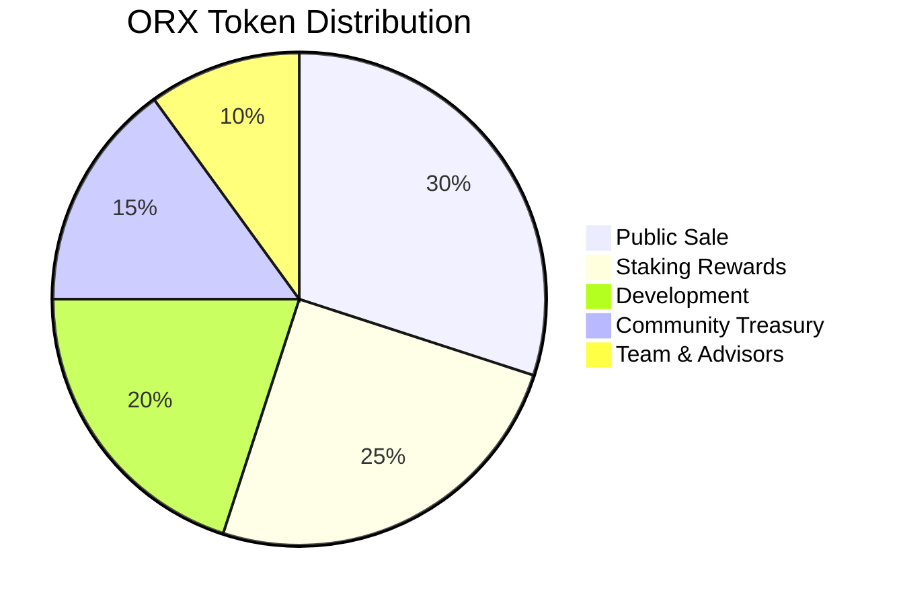

# ORX Token Contract

The ORX token is an ERC-20 utility token that powers the entire OracleX ecosystem.

##  Contract Details

| Property | Value |
|----------|-------|
| **Name** | OracleX Token |
| **Symbol** | ORX |
| **Decimals** | 18 |
| **Total Supply** | 1,000,000,000 ORX |
| **Address** | `0x7eE4f73bab260C11c68e5560c46E3975E824ed79` |
| **Network** | BNB Chain Testnet (97) |
| **Standard** | ERC-20 |

##  Core Functions

### Read Functions

#### `balanceOf`
Get token balance of an address.

```solidity
function balanceOf(address account) external view returns (uint256)
```

**Example:**
```typescript
const balance = await orxToken.balanceOf(userAddress);
console.log('Balance:', ethers.formatEther(balance), 'ORX');
```

#### `allowance`
Check spending allowance granted to a spender.

```solidity
function allowance(address owner, address spender) external view returns (uint256)
```

**Example:**
```typescript
const allowance = await orxToken.allowance(
  userAddress,
  stakingContractAddress
);
console.log('Allowance:', ethers.formatEther(allowance), 'ORX');
```

#### `totalSupply`
Get total token supply.

```solidity
function totalSupply() external view returns (uint256)
```

**Example:**
```typescript
const supply = await orxToken.totalSupply();
console.log('Total Supply:', ethers.formatEther(supply), 'ORX');
```

### Write Functions

#### `transfer`
Transfer tokens to another address.

```solidity
function transfer(address to, uint256 amount) external returns (bool)
```

**Example:**
```typescript
const tx = await orxToken.transfer(
  recipientAddress,
  ethers.parseEther('100') // 100 ORX
);
await tx.wait();
console.log('Transfer complete');
```

**Gas Estimate:** ~52,000

#### `approve`
Approve spending allowance for another address.

```solidity
function approve(address spender, uint256 amount) external returns (bool)
```

**Example:**
```typescript
// Approve staking contract to spend tokens
const tx = await orxToken.approve(
  stakingContractAddress,
  ethers.parseEther('1000') // 1000 ORX
);
await tx.wait();
console.log('Approval granted');
```

**Gas Estimate:** ~46,000

** Pro Tip:** For unlimited approval, use `ethers.MaxUint256`:
```typescript
const tx = await orxToken.approve(
  stakingContractAddress,
  ethers.MaxUint256 // Unlimited approval
);
```

#### `transferFrom`
Transfer tokens on behalf of owner (requires prior approval).

```solidity
function transferFrom(
  address from,
  address to,
  uint256 amount
) external returns (bool)
```

**Example:**
```typescript
// Contract transfers tokens from user
const tx = await orxToken.transferFrom(
  userAddress,
  contractAddress,
  ethers.parseEther('50')
);
await tx.wait();
```

**Gas Estimate:** ~64,000

##  Events

### Transfer
Emitted when tokens are transferred.

```solidity
event Transfer(address indexed from, address indexed to, uint256 value)
```

**Listening:**
```typescript
orxToken.on('Transfer', (from, to, amount, event) => {
  console.log(`Transfer: ${ethers.formatEther(amount)} ORX`);
  console.log(`From: ${from}`);
  console.log(`To: ${to}`);
});
```

**Querying:**
```typescript
// Get all transfers to an address
const filter = orxToken.filters.Transfer(null, userAddress);
const events = await orxToken.queryFilter(filter, -10000); // Last 10k blocks

events.forEach(event => {
  console.log('Received:', ethers.formatEther(event.args.value), 'ORX');
});
```

### Approval
Emitted when spending allowance is set.

```solidity
event Approval(address indexed owner, address indexed spender, uint256 value)
```

**Listening:**
```typescript
orxToken.on('Approval', (owner, spender, amount, event) => {
  console.log(`Approval: ${ethers.formatEther(amount)} ORX`);
  console.log(`Owner: ${owner}`);
  console.log(`Spender: ${spender}`);
});
```

##  Token Distribution



| Allocation | Tokens | Percentage | Vesting |
|------------|--------|------------|---------|
| **Public Sale** | 300M | 30% | Immediate |
| **Staking Rewards** | 250M | 25% | 5 years |
| **Development** | 200M | 20% | 3 years |
| **Community Treasury** | 150M | 15% | DAO controlled |
| **Team & Advisors** | 100M | 10% | 4 years, 1 year cliff |

##  Token Utilities

### 1. Prediction Markets
- Create markets: 1,000 ORX
- Place predictions: Any amount
- Earn from correct predictions

### 2. Staking
- Stake to earn rewards
- Lock periods: 30-365 days
- APY: 5-50% based on duration

### 3. Governance
- Propose changes: 10,000 ORX
- Vote on proposals: 1 ORX = 1 vote
- Delegate voting power

### 4. Fee Discounts
| ORX Balance | Fee Discount |
|-------------|--------------|
| 0-999 | 0% (2% fee) |
| 1,000-9,999 | 25% (1.5% fee) |
| 10,000-99,999 | 50% (1% fee) |
| 100,000+ | 75% (0.5% fee) |

### 5. AI Oracle Access
- Basic queries: Free
- Premium data: 10 ORX/query
- Custom oracles: Stake required

##  Complete Interface

```typescript
import { ethers } from 'ethers';

// Initialize contract
const ORX_TOKEN_ADDRESS = '0x7eE4f73bab260C11c68e5560c46E3975E824ed79';
const provider = new ethers.JsonRpcProvider(
  'https://bsc-testnet-rpc.publicnode.com'
);
const signer = await provider.getSigner();
const orxToken = new ethers.Contract(ORX_TOKEN_ADDRESS, ABI, signer);

// Read operations
const balance = await orxToken.balanceOf(userAddress);
const allowance = await orxToken.allowance(owner, spender);
const totalSupply = await orxToken.totalSupply();
const name = await orxToken.name();
const symbol = await orxToken.symbol();
const decimals = await orxToken.decimals();

// Write operations
await orxToken.transfer(to, amount);
await orxToken.approve(spender, amount);
await orxToken.transferFrom(from, to, amount);

// Events
orxToken.on('Transfer', (from, to, amount) => {});
orxToken.on('Approval', (owner, spender, amount) => {});
```

##  Security Features

-  **OpenZeppelin Standard**: Uses battle-tested ERC-20 implementation
-  **Immutable**: No upgrade mechanism, code cannot change
-  **No Mint Function**: Fixed supply, no inflation
-  **No Pause Function**: Fully decentralized, always tradeable
-  **Audited**: Security audit by CertiK (see [Audits ](../../security/audits.md))

##  Testing

```typescript
// Test token functionality
describe('ORX Token', () => {
  it('Should have correct name and symbol', async () => {
    expect(await orxToken.name()).to.equal('OracleX Token');
    expect(await orxToken.symbol()).to.equal('ORX');
  });

  it('Should transfer tokens', async () => {
    const amount = ethers.parseEther('100');
    await orxToken.transfer(recipient, amount);
    expect(await orxToken.balanceOf(recipient)).to.equal(amount);
  });

  it('Should approve and transferFrom', async () => {
    const amount = ethers.parseEther('50');
    await orxToken.approve(spender, amount);
    await orxToken.connect(spender).transferFrom(owner, recipient, amount);
    expect(await orxToken.balanceOf(recipient)).to.equal(amount);
  });
});
```

##  On-Chain Metrics

Query token metrics from the blockchain:

```typescript
// Get circulating supply
const totalSupply = await orxToken.totalSupply();
const burnedTokens = await orxToken.balanceOf(ethers.ZeroAddress);
const circulatingSupply = totalSupply - burnedTokens;

// Get largest holders (requires indexing)
const holders = await getTopHolders(ORX_TOKEN_ADDRESS, 100);

// Get transfer volume (24h)
const transfers24h = await getTransfers(ORX_TOKEN_ADDRESS, {
  fromBlock: currentBlock - 28800, // ~24h at 3s blocks
  toBlock: currentBlock
});
```

##  Integration Examples

### React Hook
```typescript
import { useState, useEffect } from 'react';
import { useWeb3 } from './useWeb3';

export const useORXBalance = () => {
  const { address, orxContract } = useWeb3();
  const [balance, setBalance] = useState('0');

  useEffect(() => {
    const fetchBalance = async () => {
      if (!address || !orxContract) return;
      const bal = await orxContract.balanceOf(address);
      setBalance(ethers.formatEther(bal));
    };

    fetchBalance();
    
    // Listen for transfers
    const filter = orxContract.filters.Transfer(null, address);
    orxContract.on(filter, fetchBalance);

    return () => orxContract.removeAllListeners(filter);
  }, [address, orxContract]);

  return balance;
};
```

### Approval Component
```typescript
const TokenApproval = ({ spender, amount }) => {
  const [approved, setApproved] = useState(false);
  const { orxContract } = useWeb3();

  const checkApproval = async () => {
    const allowance = await orxContract.allowance(address, spender);
    setApproved(allowance >= amount);
  };

  const approve = async () => {
    const tx = await orxContract.approve(spender, amount);
    await tx.wait();
    setApproved(true);
  };

  return (
    <div>
      {!approved ? (
        <button onClick={approve}>Approve ORX</button>
      ) : (
        <span> Approved</span>
      )}
    </div>
  );
};
```

##  Resources

- **BSCScan**: https://testnet.bscscan.com/token/0x7eE4f73bab260C11c68e5560c46E3975E824ed79
- **Source Code**: `/contracts/contracts/ORXToken.sol`
- **Tests**: `/contracts/test/ORXToken.test.ts`
- **ABI**: `/frontend/src/abis/ORXToken.json`

## See Also

- [Staking Contract ](staking-contract.md)
- [Token Economics ](../../tokenomics/orx-token.md)
- [How to Get ORX ](../../user-guides/getting-orx.md)

---

<div style="background: linear-gradient(135deg, #FFD700, #9333EA); padding: 1.5rem; border-radius: 12px; color: white;">
  <strong> Get Test ORX:</strong> Visit our <a href="https://oraclex.com/faucet" style="color: white; text-decoration: underline;">faucet</a> to receive 1,000 test ORX tokens for development and testing.
</div>

