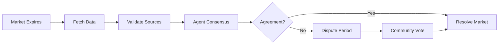
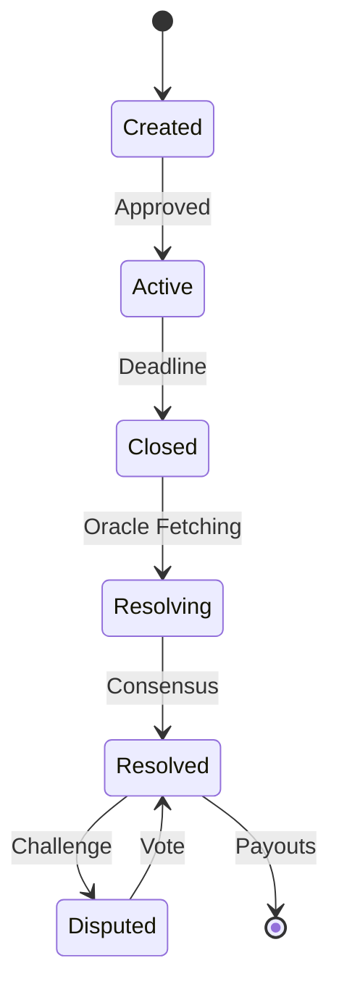

# Core Concepts

Understanding these fundamental concepts will help you make the most of OracleX. This guide covers the essential principles that power our prediction market platform.

## 🎯 Prediction Markets

### What is a Prediction Market?

A prediction market is a **trading platform where people buy and sell shares** based on the outcome of future events. Think of it as a "stock market for predictions."

**Key Features:**
- 📊 **Market-driven odds**: Prices reflect collective belief
- 💰 **Financial incentives**: Accurate predictors earn money
- 🎯 **Wisdom of crowds**: Aggregates diverse opinions
- 📈 **Real-time updates**: Odds change as new information emerges

### How Prediction Markets Work

```
1. Market Creation
   ↓
2. Users Stake on Outcomes
   ↓
3. Market Closes at Deadline
   ↓
4. Oracle Determines Winner
   ↓
5. Winners Claim Rewards
```

### Example

**Market**: "Will Bitcoin reach $100,000 by Dec 31, 2025?"

- **Outcomes**: Yes / No
- **Your Stake**: 100 ORX on "Yes"
- **Current Odds**: 60% Yes, 40% No
- **Total Pool**: 10,000 ORX
- **Your Share**: 100 / 6,000 = 1.67% of Yes pool

**If Yes Wins:**
```
Your Payout = (Total Pool / Yes Pool) × Your Stake
            = (10,000 / 6,000) × 100
            = 166.67 ORX
Profit = 166.67 - 100 = 66.67 ORX (66.7% ROI!)
```

## 🤖 TruthMesh AI Oracle

### What is an Oracle?

An **oracle** is a system that provides real-world data to blockchain smart contracts. Traditional oracles are:
- ❌ Centralized (single point of failure)
- ❌ Manual (humans decide outcomes)
- ❌ Slow (requires multiple confirmations)
- ❌ Expensive (high verification costs)

### TruthMesh Solution

OracleX's **TruthMesh** is a decentralized, AI-powered oracle system:

```
┌─────────────────────────────────────┐
│      TruthMesh Multi-Agent AI       │
├─────────────────────────────────────┤
│                                     │
│  ┌──────────┐     ┌──────────┐    │
│  │  Data    │────▶│Validator │    │
│  │ Fetcher  │     │  Agent   │    │
│  └──────────┘     └──────────┘    │
│       │                 │          │
│       ▼                 ▼          │
│  ┌──────────┐     ┌──────────┐    │
│  │ Arbiter  │◀────│Confidence│    │
│  │  Agent   │     │  Scorer  │    │
│  └──────────┘     └──────────┘    │
│       │                            │
│       ▼                            │
│  ┌──────────┐                     │
│  │  Final   │                     │
│  │ Decision │                     │
│  └──────────┘                     │
└─────────────────────────────────────┘
```

### Agent Roles

#### 1. Data Fetcher Agent
**Purpose**: Retrieves information from multiple sources

**Sources**:
- 🌐 APIs (CoinGecko, NewsAPI, Weather APIs)
- 📰 News aggregators
- 🐦 Social media (Twitter sentiment)
- 📊 Financial databases
- 🏛️ Government data

**Process**:
```python
async def fetch_bitcoin_price():
    sources = [
        fetch_coingecko(),
        fetch_coinmarketcap(),
        fetch_binance(),
        fetch_kraken()
    ]
    prices = await gather_all(sources)
    return aggregate_median(prices)
```

#### 2. Validator Agent
**Purpose**: Cross-validates data accuracy

**Checks**:
- ✅ Source reliability (historical accuracy)
- ✅ Data consistency (cross-source matching)
- ✅ Timestamp verification
- ✅ Outlier detection
- ✅ Manipulation detection

#### 3. Arbiter Agent
**Purpose**: Resolves edge cases and disputes

**Handles**:
- 🤔 Ambiguous outcomes
- ⚖️ Disputed resolutions
- 🔍 Missing data
- 📊 Statistical anomalies

#### 4. Confidence Scorer
**Purpose**: Assigns reliability scores

**Metrics**:
- 📊 Data source quality: 0-100%
- ✅ Cross-validation matches: 0-100%
- ⏱️ Data freshness: 0-100%
- 🎯 Historical accuracy: 0-100%

**Final Score**:
```
Confidence = (0.3 × Source Quality) +
             (0.3 × Cross-Validation) +
             (0.2 × Freshness) +
             (0.2 × Historical Accuracy)
```

### Resolution Process



## 💎 $ORX Token

### Token Utilities

#### 1. Staking on Predictions
- Stake ORX on market outcomes
- Winners receive share of total pool
- Losers forfeit staked tokens

#### 2. Oracle Validation
- Stake to become validator
- Earn fees from market resolutions
- Get slashed for incorrect validations

#### 3. Governance
- Vote on platform parameters
- Propose new features
- Influence fee structures

#### 4. Market Creation
- Pay fee to create markets
- Fee prevents spam
- Burned or distributed to stakers

#### 5. Premium Features
- Advanced analytics
- AI prediction insights
- Historical data access
- API rate limits

### Token Flow

```
User Acquires ORX
    ↓
┌───────────────┐
│ Stake on      │ → Win → Earn More ORX
│ Predictions   │
└───────────────┘
    ↓
┌───────────────┐
│ Stake for     │ → Earn APY Rewards
│ Validators    │
└───────────────┘
    ↓
┌───────────────┐
│ Governance    │ → Vote on Proposals
│ Participation │
└───────────────┘
    ↓
┌───────────────┐
│ Create        │ → Pay Fee → Market Lives
│ Markets       │
└───────────────┘
```

## 🏛️ Governance Model

### DAO Structure

OracleX is governed by **ORX token holders** through decentralized voting:

```
┌─────────────────────────────────────┐
│        Governance DAO                │
├─────────────────────────────────────┤
│                                     │
│  👥 Token Holders                   │
│       ↓                             │
│  📝 Create Proposals                │
│       ↓                             │
│  🗳️  Community Votes                │
│       ↓                             │
│  ⚖️  Quorum Check                   │
│       ↓                             │
│  ✅ Execute Changes                 │
│                                     │
└─────────────────────────────────────┘
```

### Proposal Types

#### 1. Parameter Changes
- Market creation fee
- Staking APY rates
- Oracle thresholds
- Fee distribution

#### 2. Feature Additions
- New market categories
- Additional data sources
- UI/UX improvements
- Integration requests

#### 3. Treasury Management
- Fund allocation
- Partnership investments
- Development grants
- Marketing campaigns

#### 4. Emergency Actions
- Pause contracts
- Resolve disputes
- Security upgrades
- Oracle adjustments

### Voting Power

```
Voting Power = Staked ORX × Time Multiplier

Time Multiplier:
- 30 days:  1.0x
- 90 days:  1.2x
- 180 days: 1.5x
- 365 days: 2.0x
```

**Example**:
```
Alice stakes 1,000 ORX for 365 days
Voting Power = 1,000 × 2.0 = 2,000 votes

Bob stakes 1,500 ORX for 30 days
Voting Power = 1,500 × 1.0 = 1,500 votes

Alice has more influence despite less tokens!
```

### Quorum Requirements

| Proposal Type | Quorum | Approval |
|--------------|--------|----------|
| Parameter Change | 30% | 66% |
| Feature Addition | 30% | 60% |
| Treasury < $100K | 30% | 60% |
| Treasury > $100K | 40% | 75% |
| Emergency Action | 50% | 80% |

## 📊 Market Economics

### How Odds Work

Markets use **automated market makers (AMM)** to calculate odds:

**Formula**: Constant Product Market Maker
```
x × y = k (constant)

Where:
x = Yes tokens in pool
y = No tokens in pool
k = constant product
```

**Example**:
```
Initial: 1,000 Yes × 1,000 No = 1,000,000

User buys 100 Yes:
- Takes 100 Yes from pool
- Adds Y No to maintain k

(1,000 - 100) × (1,000 + Y) = 1,000,000
900 × (1,000 + Y) = 1,000,000
1,000 + Y = 1,111.11
Y = 111.11

User pays: 111.11 ORX
Gets: 100 Yes shares
Price per share: 1.11 ORX
```

### Fee Structure

#### Trading Fees
- **Market Creation**: 0.01 BNB
- **Trading**: 0% (no trading fee!)
- **Resolution**: 2% of winning pool

#### Fee Distribution
```
100% of fees collected
    ↓
├─ 40% → Stakers (APY rewards)
├─ 30% → DAO Treasury
├─ 20% → Oracle Validators
└─ 10% → Development Fund
```

## 🔐 Security & Trust

### Smart Contract Security

#### Multi-Layer Protection
1. **Audited Contracts**: Professional security audits
2. **Open Source**: All code publicly verifiable
3. **Time Locks**: Critical changes have delay
4. **Multi-sig**: Important functions require multiple signatures
5. **Circuit Breakers**: Emergency pause functionality

### Non-Custodial

- ✅ You always control your funds
- ✅ No deposits required
- ✅ Withdraw anytime (after lock period)
- ✅ No central party can freeze funds

### Oracle Security

#### Sybil Resistance
- Validators must stake ORX
- Multiple validators required
- Slashing for malicious behavior
- Reputation system

#### Data Integrity
- Multiple data sources
- Cross-validation required
- Outlier detection
- Historical accuracy tracking

## 🎮 Gamification

### Reputation System

Earn reputation through:
- ✅ Accurate predictions
- 📈 High ROI trades
- 🎯 Consistent performance
- 👥 Community engagement

### Leaderboards

Compete in multiple categories:
- 🏆 **Top Predictors**: Most accurate forecasters
- 💰 **Highest Earnings**: Biggest profit makers
- 📊 **Trading Volume**: Most active traders
- 🎯 **Win Rate**: Best success percentage
- 🔥 **Streak**: Longest winning streaks

### Achievements & Badges

Unlock achievements:
- 🎯 **First Blood**: Make first prediction
- 💯 **Perfect 10**: Win 10 predictions in a row
- 🐋 **Whale**: Stake over 10,000 ORX
- 🧠 **Oracle**: 90%+ accuracy over 100 predictions
- 👑 **Diamond Hands**: 365-day stake completion

## 📈 Advanced Concepts

### Market Manipulation Prevention

#### Safeguards
1. **Minimum Liquidity**: Markets need base liquidity
2. **Trade Limits**: Max trade size per user
3. **Oracle Decentralization**: Multiple validators
4. **Dispute Mechanism**: Community can challenge
5. **Slippage Protection**: Automatic price impact limits

### Flash Resolution

For instant settlements:
```
Traditional Oracle: 15-30 minutes
TruthMesh with Cache: <1 minute
```

### Cross-Market Correlation

Advanced users can:
- Trade correlated markets
- Hedge positions
- Arbitrage opportunities
- Portfolio optimization

## 🔄 Market Lifecycle



### States Explained

| State | Description | Actions |
|-------|-------------|---------|
| **Created** | Market submitted, awaiting approval | Edit, Cancel |
| **Active** | Open for predictions | Stake, Trade |
| **Closed** | Past deadline, no new stakes | View only |
| **Resolving** | Oracle determining outcome | Monitor |
| **Resolved** | Outcome determined | Claim rewards |
| **Disputed** | Outcome challenged | Vote |

## 📚 Further Reading

- [Quick Start Guide →](quick-start.md)
- [Architecture Overview →](architecture.md)
- [Token Economics →](../tokenomics/orx-token.md)
- [Smart Contracts →](../developers/smart-contracts/README.md)

---

<div style="background: linear-gradient(135deg, #FFD700, #9333EA); padding: 1.5rem; border-radius: 12px; color: white;">
  <strong>💡 Pro Tip:</strong> Understanding these concepts gives you an edge. Use AI analysis, check confidence scores, and diversify your predictions for best results!
</div>
