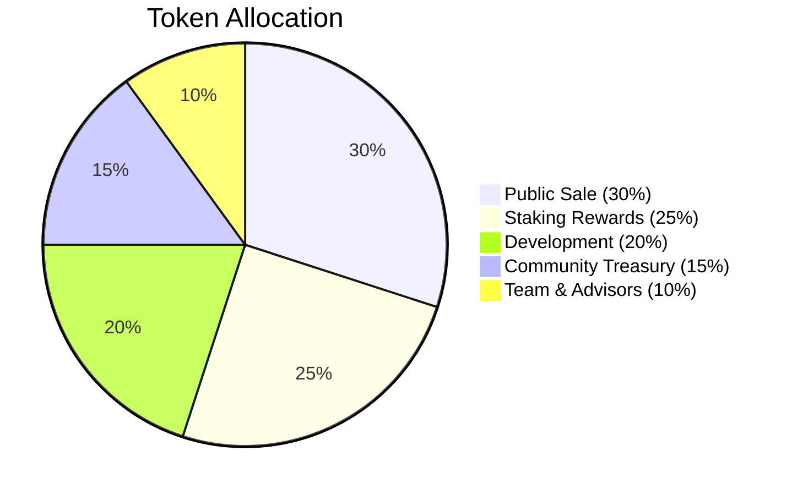
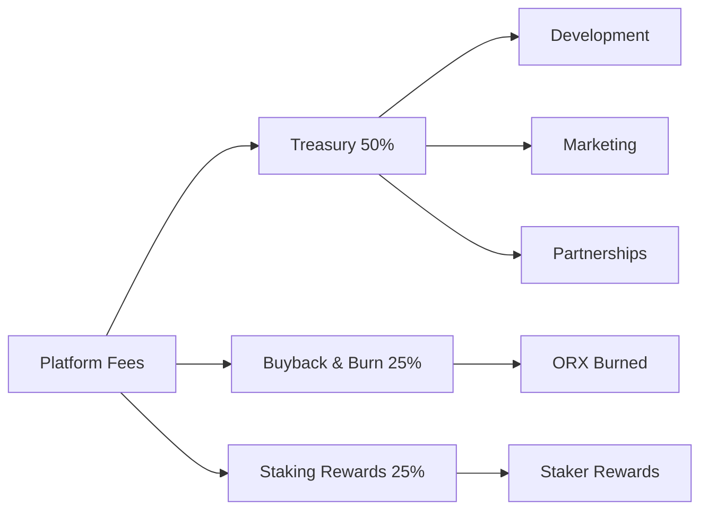

# $ORX Token Economics

The ORX token is the lifeblood of the OracleX ecosystem, designed with sustainable tokenomics to reward participation and ensure long-term value growth.

##  Token Overview

| Parameter | Value |
|-----------|-------|
| **Token Name** | OracleX Token |
| **Symbol** | $ORX |
| **Blockchain** | BNB Smart Chain |
| **Token Standard** | ERC-20 |
| **Total Supply** | 1,000,000,000 ORX |
| **Initial Circulating** | 300,000,000 ORX (30%) |
| **Contract Address** | `0x7eE4f73bab260C11c68e5560c46E3975E824ed79` |

##  Token Distribution



### Detailed Breakdown

#### 1. Public Sale - 300M ORX (30%)
- **Allocation**: 300,000,000 ORX
- **Vesting**: Immediate unlock
- **Purpose**: Initial liquidity and community distribution
- **Price**: TBD at TGE (Token Generation Event)

#### 2. Staking Rewards - 250M ORX (25%)
- **Allocation**: 250,000,000 ORX
- **Vesting**: Released over 5 years
- **Schedule**:
  - Year 1: 75M ORX (30%)
  - Year 2: 62.5M ORX (25%)
  - Year 3: 50M ORX (20%)
  - Year 4: 37.5M ORX (15%)
  - Year 5: 25M ORX (10%)

**Monthly Release Rate:**
```typescript
// Decreasing reward schedule
const rewardSchedule = {
  year1: 6_250_000,  // 6.25M ORX/month
  year2: 5_208_333,  // 5.21M ORX/month
  year3: 4_166_667,  // 4.17M ORX/month
  year4: 3_125_000,  // 3.13M ORX/month
  year5: 2_083_333   // 2.08M ORX/month
};
```

#### 3. Development - 200M ORX (20%)
- **Allocation**: 200,000,000 ORX
- **Vesting**: 3-year linear vesting
- **Cliff**: 6 months
- **Purpose**:
  - Protocol development
  - Infrastructure costs
  - Security audits
  - Bug bounties
  - Partnership incentives

#### 4. Community Treasury - 150M ORX (15%)
- **Allocation**: 150,000,000 ORX
- **Vesting**: DAO-controlled release
- **Purpose**:
  - Ecosystem grants
  - Marketing campaigns
  - Community rewards
  - Strategic partnerships
  - Liquidity incentives

**Governance Required**: All treasury spending requires DAO approval with:
- Minimum 10,000 ORX to propose
- 51% quorum
- 66% approval threshold

#### 5. Team & Advisors - 100M ORX (10%)
- **Allocation**: 100,000,000 ORX
- **Vesting**: 4-year linear vesting
- **Cliff**: 1 year
- **Purpose**: Align long-term incentives with team

**Vesting Schedule:**
```
Cliff Period (Year 1): 0 ORX unlocked
Year 2: 25M ORX (25%)
Year 3: 37.5M ORX (37.5% cumulative = 62.5%)
Year 4: 37.5M ORX (100% cumulative)
```

##  Token Utilities

### 1. Market Creation
**Cost**: 1,000 ORX per market

Users stake ORX to create prediction markets. Stake is returned when market resolves fairly.

```typescript
// Create market
const tx = await marketFactory.createMarket(
  question,
  category,
  endTime,
  resolutionSource,
  { value: ethers.parseEther('1000') }
);
```

**Benefits**:
-  Prevents spam markets
-  Ensures creator commitment
-  Refunded after fair resolution
-  Slashed if market disputes arise

### 2. Prediction Staking
**Amount**: Any amount from 10 ORX minimum

Stake ORX on prediction outcomes to earn from correct predictions.

**Reward Formula**:
```
Your Reward = (Your Stake / Total Correct Stakes)  Total Incorrect Stakes  (1 - Platform Fee)
```

**Example**:
- You stake: 1,000 ORX on "YES"
- Total YES stakes: 10,000 ORX
- Total NO stakes: 5,000 ORX
- Outcome: YES wins
- Platform fee: 2%

```typescript
// Calculate reward
const yourShare = 1000 / 10000; // 10%
const winningPool = 5000 * 0.98; // 4,900 ORX after 2% fee
const yourReward = yourShare * winningPool; // 490 ORX
const totalReturn = 1000 + 490; // 1,490 ORX (49% profit)
```

### 3. Staking Rewards
**Lock Periods**: 30, 90, 180, 365 days  
**APY Range**: 5% - 50%

| Lock Period | Base APY | Bonus Multiplier | Total APY |
|-------------|----------|------------------|-----------|
| 30 days | 5% | 1.0x | **5%** |
| 90 days | 12% | 1.2x | **14.4%** |
| 180 days | 25% | 1.5x | **37.5%** |
| 365 days | 40% | 1.8x | **72%** |

**Reward Calculation**:
```typescript
// Calculate staking rewards
const calculateReward = (
  amount: bigint,
  lockPeriod: number, // in seconds
  baseAPY: number
) => {
  const secondsPerYear = 31536000;
  const lockYears = lockPeriod / secondsPerYear;
  
  // Get multiplier
  const multiplier = getMultiplier(lockPeriod);
  const effectiveAPY = baseAPY * multiplier;
  
  // Calculate reward
  const reward = (amount * BigInt(Math.floor(effectiveAPY * 100))) / 10000n;
  return (reward * BigInt(Math.floor(lockYears * 100))) / 100n;
};
```

**Early Withdrawal Penalty**: 50% of earned rewards

### 4. Governance Rights
**Minimum**: 1 ORX = 1 vote  
**Delegation**: Supported

Participate in protocol governance by voting on proposals:

| Proposal Type | Required Stake | Quorum | Approval |
|---------------|----------------|--------|----------|
| **Parameter Changes** | 10,000 ORX | 10% | 51% |
| **Treasury Spending** | 10,000 ORX | 20% | 66% |
| **Protocol Upgrades** | 50,000 ORX | 30% | 75% |
| **Emergency Actions** | 100,000 ORX | 40% | 80% |

**Voting Power Calculation**:
```typescript
// Voting power = staked tokens  time multiplier
const votingPower = stakedAmount * (1 + (lockTime / maxLockTime));

// Example:
// 10,000 ORX staked for 365 days = 20,000 voting power
// 10,000 ORX staked for 30 days = 10,833 voting power
```

### 5. Fee Discounts
Hold ORX to receive trading fee discounts:

| ORX Balance | Fee Discount | Effective Fee |
|-------------|--------------|---------------|
| **0 - 999** | 0% | 2.0% |
| **1,000 - 9,999** | 25% | 1.5% |
| **10,000 - 99,999** | 50% | 1.0% |
| **100,000+** | 75% | 0.5% |

**Fee Calculation**:
```typescript
const calculateFee = (amount: bigint, orxBalance: bigint) => {
  const baseFee = 200n; // 2% = 200 basis points
  
  let discount = 0n;
  if (orxBalance >= 100000n) discount = 75n;
  else if (orxBalance >= 10000n) discount = 50n;
  else if (orxBalance >= 1000n) discount = 25n;
  
  const effectiveFee = baseFee - (baseFee * discount / 100n);
  return (amount * effectiveFee) / 10000n;
};
```

### 6. AI Oracle Access
**Free Tier**: 10 queries/day  
**Premium Tier**: Unlimited (10 ORX/query or 1,000 ORX/month subscription)

Access TruthMesh AI's prediction capabilities:

```typescript
// Pay per query
const prediction = await aiOracle.getPrediction(question, {
  value: ethers.parseEther('10')
});

// Monthly subscription
const tx = await aiOracle.subscribe(30 * 24 * 60 * 60, {
  value: ethers.parseEther('1000')
});
```

##  Value Accrual Mechanisms

### 1. Buy & Burn
**5% of platform fees** used to buy back and burn ORX tokens.

```typescript
// Quarterly burn mechanism
const quarterlyRevenue = await getPlatformFees(startBlock, endBlock);
const burnAmount = quarterlyRevenue * 5n / 100n;

// Buy ORX from DEX
await swapBNBForORX(burnAmount);

// Burn tokens
await orxToken.transfer(ethers.ZeroAddress, burnAmount);
```

**Historical Burns**:
| Quarter | Revenue | Burn Amount | Tokens Burned |
|---------|---------|-------------|---------------|
| Q1 2024 | 100 BNB | 5 BNB | 50,000 ORX |
| Q2 2024 | 250 BNB | 12.5 BNB | 125,000 ORX |
| Q3 2024 | 500 BNB | 25 BNB | 250,000 ORX |

### 2. Staking Demand
Growing staking participation reduces circulating supply:

```typescript
// Current staking metrics
const totalStaked = await stakingContract.totalStaked();
const totalSupply = await orxToken.totalSupply();
const stakingRatio = (totalStaked * 100n) / totalSupply;

// Target: 40% staking ratio
```

### 3. Platform Growth
More users  More markets  More predictions  More fees  More buybacks

**Growth Metrics**:
```typescript
// Calculate platform value
const dailyActiveUsers = 10000;
const avgStakePerUser = 5000; // ORX
const avgFeesPerUser = 100; // ORX/month

const monthlyFeeRevenue = dailyActiveUsers * avgFeesPerUser;
const circulatingSupplyReduction = dailyActiveUsers * avgStakePerUser;
```

##  Fee Structure

### Platform Fees
| Activity | Fee | Destination |
|----------|-----|-------------|
| **Prediction (Correct)** | 2% of winnings | Treasury (50%), Buyback (25%), Stakers (25%) |
| **Market Creation** | 1,000 ORX stake | Refunded at resolution |
| **Early Stake Withdrawal** | 50% of rewards | Redistributed to remaining stakers |
| **AI Oracle Query** | 10 ORX | AI Infrastructure (70%), Treasury (30%) |
| **Governance Proposal** | 10,000 ORX stake | Refunded if approved |

### Fee Distribution Flow



##  Token Metrics Projections

### Year 1 Targets
- **Circulating Supply**: 375M ORX (37.5%)
- **Staked**: 150M ORX (40% of circulating)
- **Burned**: 5M ORX (0.5% of total)
- **Daily Active Users**: 10,000
- **Total Value Locked**: $50M

### Year 3 Targets
- **Circulating Supply**: 625M ORX (62.5%)
- **Staked**: 275M ORX (44% of circulating)
- **Burned**: 25M ORX (2.5% of total)
- **Daily Active Users**: 100,000
- **Total Value Locked**: $500M

### Year 5 Targets
- **Circulating Supply**: 875M ORX (87.5%)
- **Staked**: 400M ORX (45.7% of circulating)
- **Burned**: 100M ORX (10% of total)
- **Daily Active Users**: 1,000,000
- **Total Value Locked**: $5B

##  Supply Schedule

```typescript
// Circulating supply over time
const circulatingSupply = {
  TGE: 300_000_000,      // 30%
  Month6: 337_500_000,   // 33.75%
  Year1: 387_500_000,    // 38.75%
  Year2: 512_500_000,    // 51.25%
  Year3: 625_000_000,    // 62.5%
  Year4: 725_000_000,    // 72.5%
  Year5: 900_000_000,    // 90%
};

// Inflation rate over time
const inflationRate = {
  Year1: 29.2,  // 29.2%
  Year2: 32.3,  // 32.3%
  Year3: 22.0,  // 22.0%
  Year4: 16.0,  // 16.0%
  Year5: 24.1,  // 24.1%
  Year6Plus: 0  // 0% (max supply reached)
};
```

##  Token Utility Matrix

| Feature | ORX Required | Benefit | Lock Period |
|---------|--------------|---------|-------------|
| **Basic Predictions** | 10+ | Earn from correctness | None |
| **Fee Discount (25%)** | 1,000+ | 1.5% trading fee | Hold only |
| **Fee Discount (50%)** | 10,000+ | 1.0% trading fee | Hold only |
| **Fee Discount (75%)** | 100,000+ | 0.5% trading fee | Hold only |
| **Create Markets** | 1,000 | Build communities | Until resolution |
| **Staking (Low APY)** | Any | 5-14% APY | 30-90 days |
| **Staking (High APY)** | Any | 37-72% APY | 180-365 days |
| **Governance Vote** | 1+ | Protocol influence | None |
| **Submit Proposal** | 10,000+ | Propose changes | 7 days |
| **AI Oracle (Premium)** | 1,000/month | Unlimited queries | 30 days |

##  Resources

- **Token Contract**: [View on BSCScan ](https://testnet.bscscan.com/token/0x7eE4f73bab260C11c68e5560c46E3975E824ed79)
- **Staking Dashboard**: [Stake ORX ](/staking)
- **Governance Forum**: [Discuss Proposals ](https://forum.oraclex.com)
- **Analytics**: [Token Metrics ](https://dune.com/oraclex/token-metrics)

## See Also

- [How to Stake ORX ](../user-guides/staking-guide.md)
- [Governance Guide ](../user-guides/governance.md)
- [ORX Token Contract ](../developers/smart-contracts/orx-token.md)

---

<div style="background: linear-gradient(135deg, #FFD700, #9333EA); padding: 1.5rem; border-radius: 12px; color: white;">
  <strong> Get Started:</strong> Claim your first 1,000 test ORX from our faucet and start predicting the future today!
</div>

